# LAPOR System Architecture

## Overview

LAPOR is a full-stack web application built with a modern architecture that separates concerns between frontend, backend, and database layers. The system follows RESTful API principles and implements secure authentication and authorization.

## System Architecture Diagram

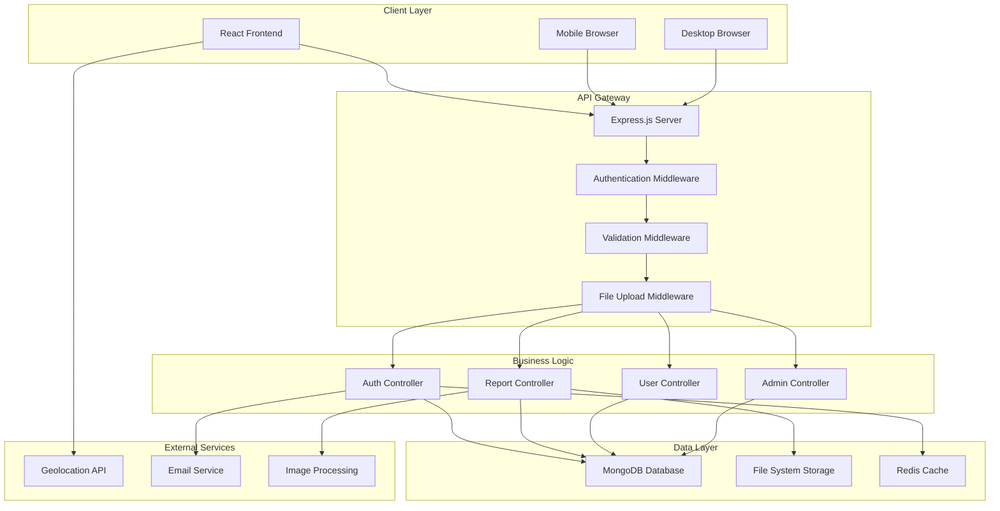

## Component Architecture

### Frontend Architecture

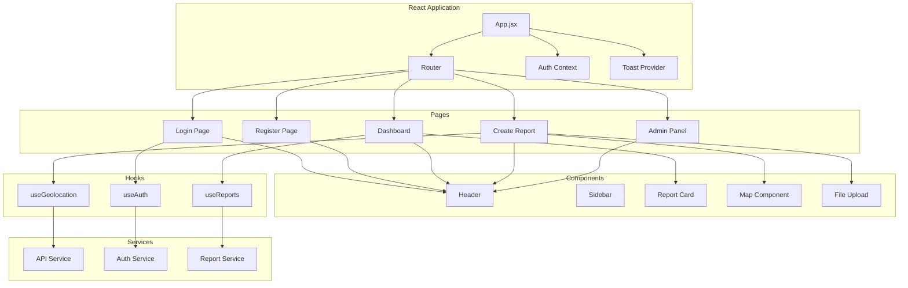

### Backend Architecture

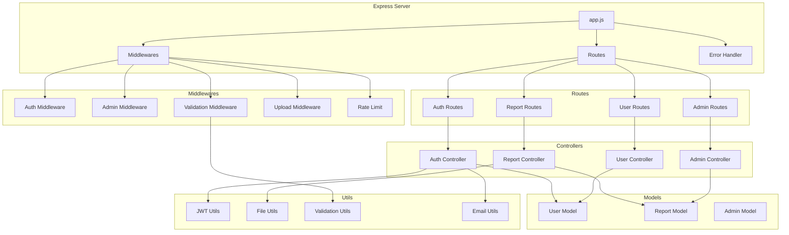

## Data Flow Diagrams

### User Registration Flow

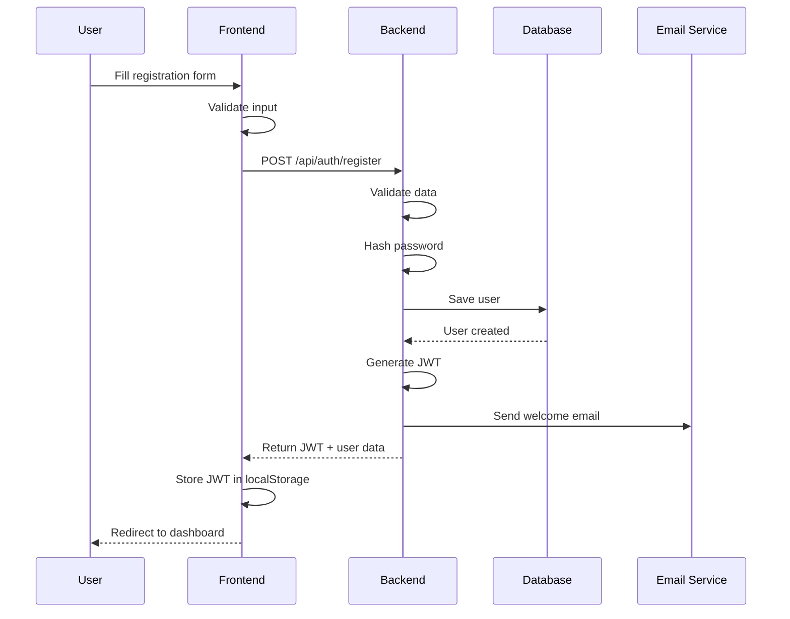

### Report Creation Flow

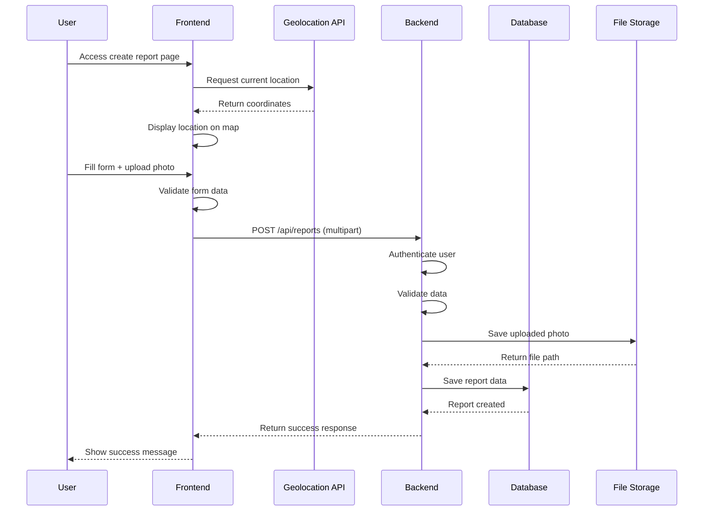

### Admin Report Management Flow

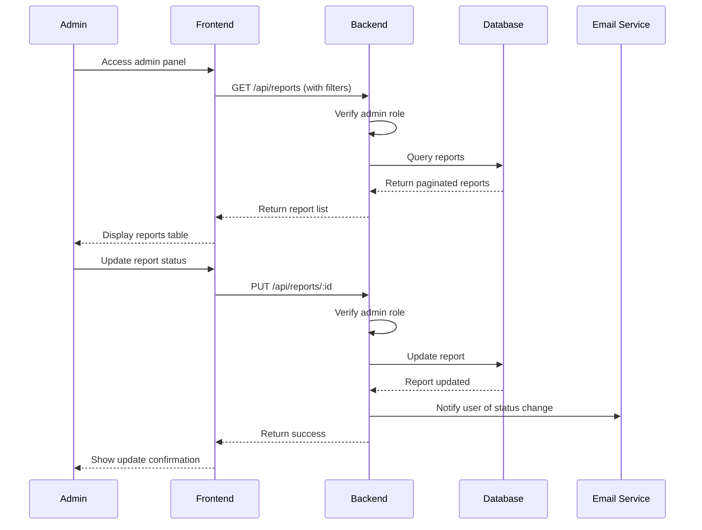

## Database Schema

### Entity Relationship Diagram

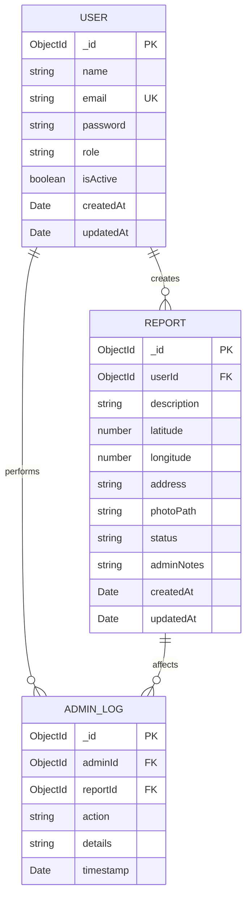

### Collection Schemas

#### Users Collection
```javascript
{
  _id: ObjectId,
  name: String (required, 2-50 chars),
  email: String (required, unique, valid email),
  password: String (required, hashed),
  role: String (enum: ['user', 'admin'], default: 'user'),
  isActive: Boolean (default: true),
  createdAt: Date (default: Date.now),
  updatedAt: Date (default: Date.now)
}
```

#### Reports Collection
```javascript
{
  _id: ObjectId,
  user: ObjectId (ref: 'User', required),
  description: String (required, 10-1000 chars),
  latitude: Number (required, -90 to 90),
  longitude: Number (required, -180 to 180),
  address: String (optional),
  photoPath: String (required),
  status: String (enum: ['pending', 'verified', 'rejected', 'in_progress', 'working', 'completed'], default: 'pending'),
  adminNotes: String (optional),
  createdAt: Date (default: Date.now),
  updatedAt: Date (default: Date.now)
}
```

## Security Architecture

### Authentication & Authorization Flow

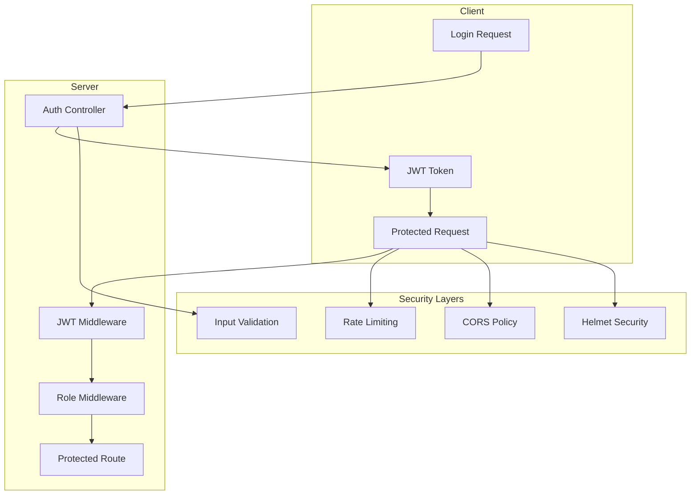

### Security Measures

1. **Authentication**
   - JWT tokens with expiration
   - Refresh token mechanism
   - Password hashing with bcrypt

2. **Authorization**
   - Role-based access control (RBAC)
   - Route-level permissions
   - Resource-level permissions

3. **Input Security**
   - Express-validator for input validation
   - Data sanitization
   - File upload restrictions

4. **API Security**
   - Rate limiting
   - CORS configuration
   - Security headers with Helmet
   - Request size limits

## Deployment Architecture

### Production Deployment

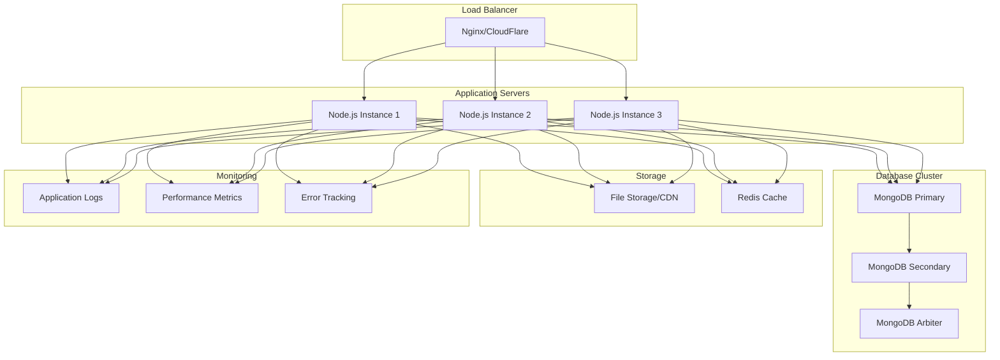

### Container Architecture (Docker)

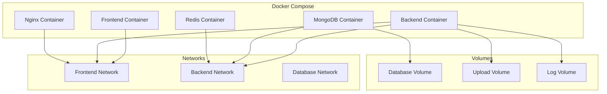

## Performance Considerations

### Optimization Strategies

1. **Database Optimization**
   - Proper indexing on frequently queried fields
   - Aggregation pipelines for complex queries
   - Connection pooling

2. **Caching Strategy**
   - Redis for session storage
   - API response caching
   - Static asset caching

3. **File Handling**
   - Image compression and optimization
   - CDN for static file delivery
   - Lazy loading for images

4. **Frontend Optimization**
   - Code splitting and lazy loading
   - Bundle optimization with Vite
   - Service worker for offline support

## Monitoring and Logging

### Logging Strategy

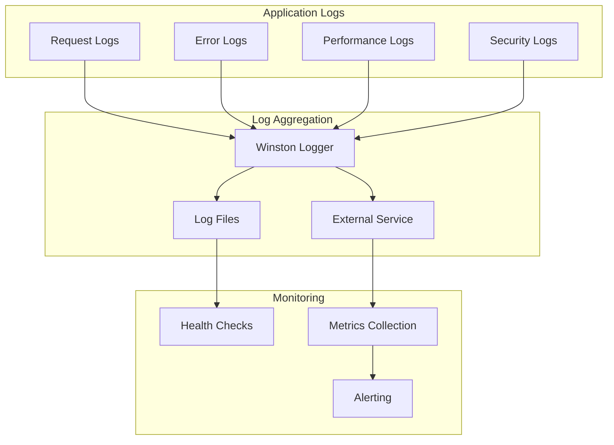

### Key Metrics

- **Performance Metrics**
  - Response time
  - Throughput
  - Error rates
  - Database query performance

- **Business Metrics**
  - User registration rate
  - Report creation rate
  - Report resolution time
  - User engagement

- **Infrastructure Metrics**
  - Server resource usage
  - Database performance
  - File storage usage
  - Network latency

## Scalability Considerations

### Horizontal Scaling

1. **Application Layer**
   - Stateless application design
   - Load balancer distribution
   - Auto-scaling based on metrics

2. **Database Layer**
   - MongoDB replica sets
   - Sharding for large datasets
   - Read replicas for query distribution

3. **Storage Layer**
   - Distributed file storage
   - CDN for global distribution
   - Caching layers

### Future Enhancements

1. **Microservices Architecture**
   - Service decomposition
   - API gateway
   - Service mesh

2. **Real-time Features**
   - WebSocket integration
   - Push notifications
   - Live updates

3. **Advanced Analytics**
   - Data warehouse integration
   - Machine learning for damage assessment
   - Predictive analytics

This architecture documentation provides a comprehensive overview of the LAPOR system design, from high-level architecture to detailed implementation considerations. It serves as a guide for developers, system administrators, and stakeholders to understand the system's structure and design decisions.